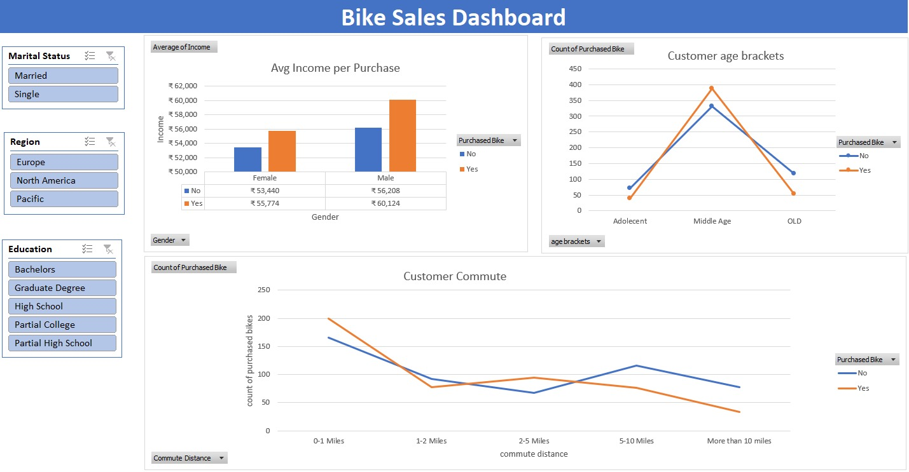

# 🚲 Bike Sales Analysis 

_Analyzing customer demographic and behavioral patterns influencing bike purchases using Excel._

---

## 📌 Table of Contents
- <a href="#overview">Overview</a>
- <a href="#business-problem">Business Problem</a>
- <a href="#dataset">Dataset</a>
- <a href="#tools--technologies">Tools & Technologies</a>
- <a href="#project-structure">Project Structure</a>
- <a href="#research-questions--key-findings">Research Questions & Key Findings</a>
- <a href="#dashboard-and-insights">Dashboard and Insights</a>
- <a href="#final-recommendations">Final Recommendations</a>
- <a href="#author--contact">Author & Contact</a>

---
<h2><a class="anchor" id="overview"></a>Overview</h2>

This project analyzes customer demographics and behavioral patterns to understand factors influencing bike purchases.Using an interactive Excel dashboard, the analysis explores how income, age, commute distance, region, marital status, and education impact purchasing decisions.The goal is to provide data-driven insights to improve marketing targeting and sales strategy.

---
<h2><a class="anchor" id="business-problem"></a>Business Problem</h2>

This project aims understand:

- Which demographic groups are most likely to purchase bikes?
- Does income influence buying decisions?
- What commute distance correlates with higher purchase rates?
- How do region, marital status, and education affect sales?

Without data segmentation, marketing campaigns risk low conversion and inefficient spending.

---
<h2><a class="anchor" id="dataset"></a>Dataset</h2>

- CSV files located in `/data/` folder (bike_sales)

---

<h2><a class="anchor" id="tools--technologies"></a>Tools & Technologies</h2>

- Microsoft Excel
- Pivot Tables
- Pivot Charts
- Slicers
- Calculated Fields
- Interactive Dashboard Design

---
<h2><a class="anchor" id="project-structure"></a>Project Structure</h2>

```
Bike_sales/
│
├── README.md
├── .gitignore
├── Bike_Sales_Documentation.pdf
│
├── dashboard/                  # Excel dashboard file
│   └──bike_sales_dashboard.xlsx
```

---
<h2><a class="anchor" id="research-questions--key-findings"></a>Research Questions & Key Findings</h2>

**💰 Income Influence**
- Customers who purchased bikes have higher average income compared to non-buyers.
- Male purchasers show the highest income levels overall.

**👥 Age Segment**
- Middle-aged customers represent the highest purchasing group.

**🚴 Commute Distance**
- Customers commuting 0–1 miles and 2–5 miles show higher purchase rates.
- Long-distance commuters (>10 miles) show lower purchase interest.

**🌍 Regional Patterns**
- Regional filtering reveals variation in buying behavior across global markets.

---
<h2><a class="anchor" id="dashboard-ans-insights"></a>Dashboard and Insights</h2>

**🔹 KPI Comparison**
- Average Income (Purchased vs Not Purchased)
- Purchase Count by Segment
- Gender-based income comparison

**🔹 Demographic Analysis**
- Age Bracket Distribution
- Education Level Segmentation
- Marital Status Filtering
- Regional Breakdown (Europe, North America, Pacific)

**🔹 Behavioral Analysis**
- Commute Distance vs Purchase Behavior
- Short-distance vs Long-distance commuting trends

**🔹 Interactive Filters**
- Marital Status
- Region
- Education Level

These slicers allow dynamic segmentation of customer groups.



---
<h2><a class="anchor" id="final-recommendations"></a>Final Recommendations</h2>

- Target middle-aged working professionals
- Promote bikes as short-distance commuting solutions
- Focus on mid-to-high income segments
- Customize regional marketing campaigns

---
<h2><a class="anchor" id="author--contact"></a>Author & Contact</h2>

**Shriya Bade**    
📧 Email: shriyabade15@gmail.com  
🔗 [LinkedIn](https://www.linkedin.com/in/shriyabade)  
